# studentInfoManager

C++程序设计练习——学生信息管理系统，基于Qt+MySQL

## 课程原要求如下：

## 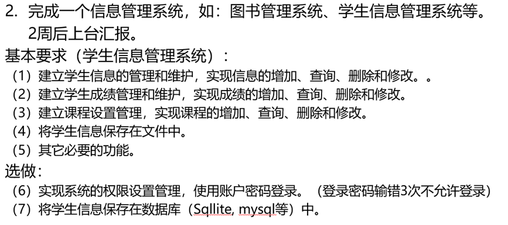

具体系统设计如下：

学生信息管理系统采用qt 5.9.8进行编写，借助mysql存储数据

mysql版本为8.0.23 MySQL Community Server

数据库管理工具采用MySQL Workbench 8.0 CE

将所有需要的数据分为6个表，分别是：

admin表：管理员信息表，存取管理员的id、管理员账号、管理员密码

class表：班级信息表，存储班级id、班级名、班级专业、班级人数、班主任

course表：课程信息表，存储课程id、课程名、任课教师、开课学期、上课地点、上课时间、学分数

score表：成绩信息表，存储学生id、课程id、课程名、分数、任课教师

student表：学生信息表，存储学生id、学生姓名、性别、年龄、专业、所属班级id、籍贯、联系方式、学生密码、学生状态

student_course表：学生选课表，存储选课学生id和对应的选取课程的课程id

## 各表结构如下：

admin表：

主码为aid

class表：

主码为classId

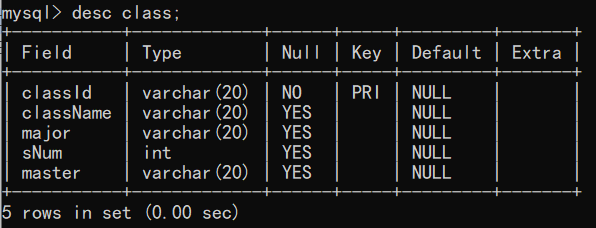

course表：

主码为cId

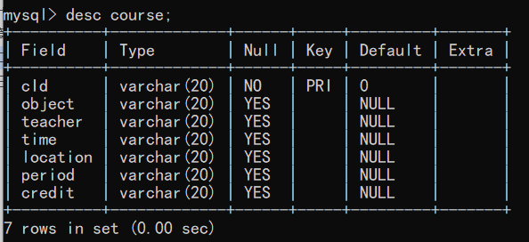

score表：

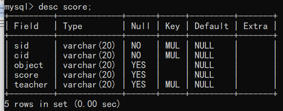

其中sid和cid为外码

sid参考student表的sId属性

cid参考course表的cId属性

student表：

主码为sId

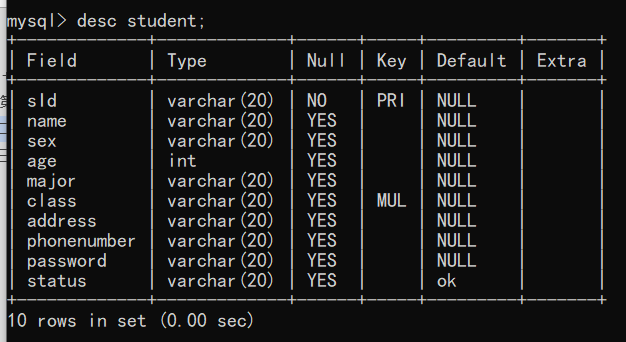

其中class为外码

class参考class表的classId属性

student_course表：

主码为sId和cId

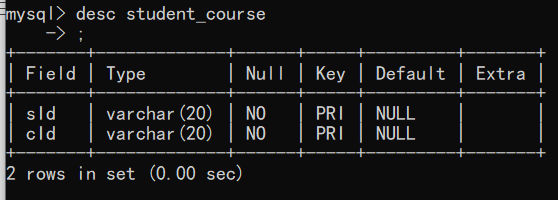

其中sId和cId为外码

sId参考student表的sId属性

cId参考course表的cId属性

登录流程如下图

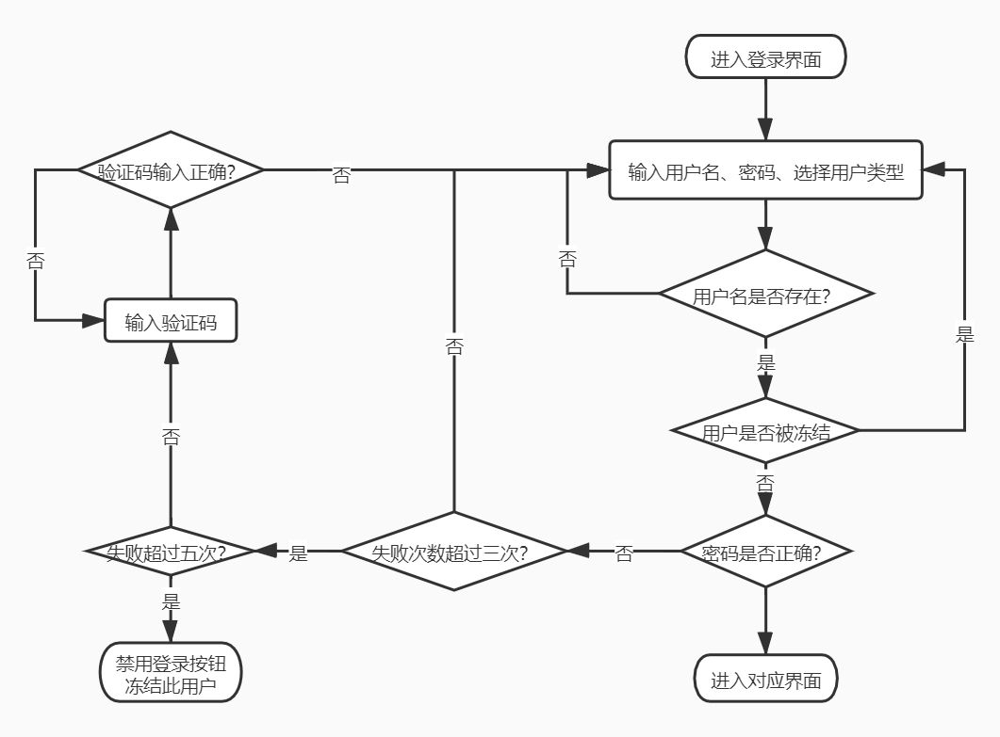

学生端功能：

1.  学生信息：查看个人基本信息、修改个人密码

2.  班级信息：查看个人所属班级基本情况

3.  成绩信息：查询个人成绩（可实现模糊查询）

4.  课程信息：查看个人所选所有课程、查询其他课程基本信息（可实现模糊查询）

管理员端功能：

1.  学生信息管理：

2.  查询学生基本信息、查看所有学生基本信息、修改学生基本信息、删除学生基本信息、重置学生密码、添加学生信息

3.  班级信息管理：

4.  查询班级基本信息、查看所有班级信息、修改班级信息、删除班级信息、添加班级信息

5.  课程信息管理：

6.  查询课程基本信息、查看所有课程信息、修改课程信息、删除课程信息、添加课程信息

7.  成绩信息管理：

8.  查询成绩信息（包括根据学号查找和根据课程号查找）、查看所有成绩信息、添加成绩信息、修改成绩信息（仅可修改成绩）、学生个人成绩统计、课程成绩统计

9.  选课信息管理：

10. 查询选课信息（包括根据学号查找和根据课程号查找）、查看所有选课信息、添加选课信息、删除选课信息

在学生端和管理员端的使用中，只要有表的界面，都添加了导出为Excel的功能，点击后即可将当前显示的表的信息导出到excel

功能实现简单描述：

对于各界面之间如何传值，可以设置一个global文件，把需要跨界面/全局使用的一些变量和函数写在global中，如数据库连接所用的端口、用户名、密码、连接函数等

系统的核心功能增删改查大部分都是简单的mysql语句，比如查找用的基本都是单表内的select，更新或修改用update，删除就是delete，稍微复杂一点的是统计，部分用到了MySQL的函数，比如sum、count、max、min等，统计选课人数、选课数等用到了两个表的连接操作，但都不难，都是一些很基础的mysql语句

稍微特殊的是如下三个功能：

第一个是导出为excel，用到了QAxObject类，并且用到了Excel.Application，具体实现过程是参考百度的教程
\+
自己改写部分代码，实现效果不能说很完美，因为即使数据很少，导出时还是会有明显的卡顿，其次是导出的单元格格式设置有问题，如学号11920192203642会显示为1.19202E+13

第二个是验证码，只需要在登录界面的cpp中设置登陆次数变量，当达到3时启动paintEvent事件，根据随机生成的思维字母以及根据时间随机变化的颜色来绘制验证码，同时重写鼠标单击函数，当单击验证码图片区域时就更新执行repaint来更新验证码

第三个是密码加密，因为考虑到隐私安全性问题，将所有用户的密码采用md5码加密的方式存储在数据库中，所有涉及到密码的操作都要经过加密，实现采用QCryptographicHash头文件，具体实现较为简单，不再赘述

## 界面截图：

所有界面和对应的一些实现类如下：

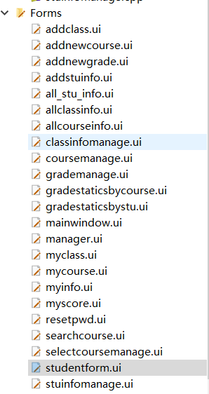

下面仅展示部分界面：

登录界面：

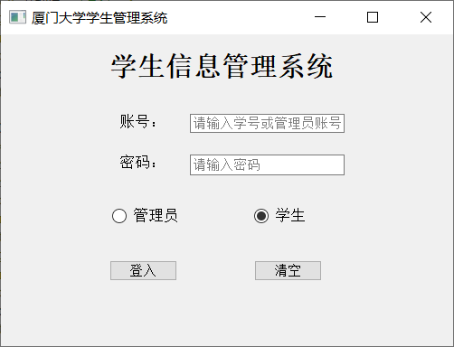

登录界面失败三次后呈现验证码：

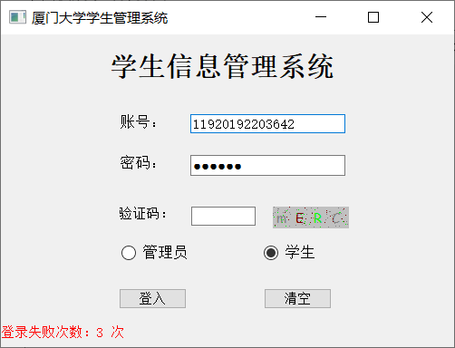

登录失败五次后冻结该用户：

管理员端主界面：

  
学生信息管理：

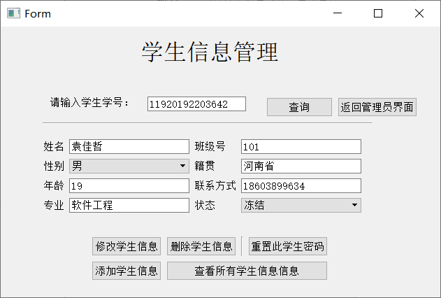

查看所有学生信息：

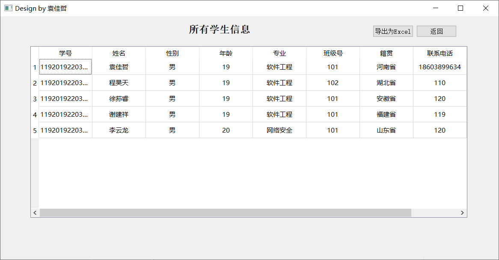

导出学生信息为Excel效果图（excel是测试时导出的，和上图有不同）：

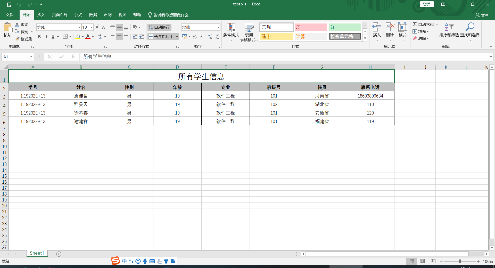

成绩信息管理：

学生成绩统计：

学生端主界面

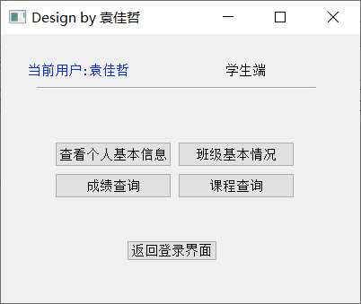

个人基本信息界面：

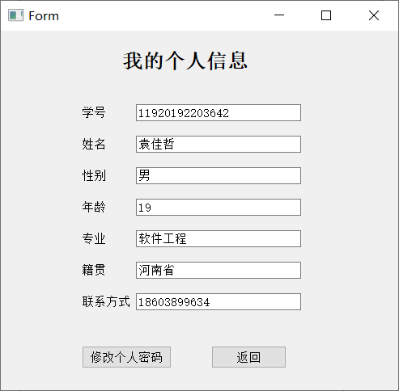

查询个人成绩：

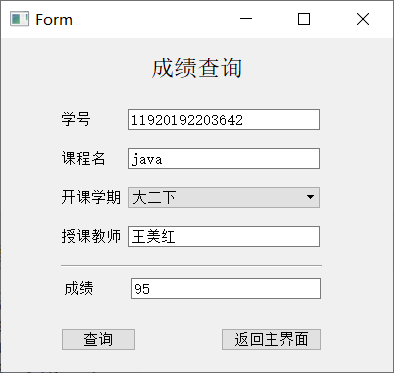

课程信息：

查询其它课程：

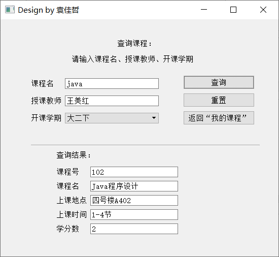

因篇幅限制，以上仅展示部分界面

## 未完善的功能：

1.  管理员在重置密码、删除用户，或者用户本人在修改面时，向用户发送邮件通知，因为发邮件要用到smtp和pop3，windows版的qt少了一些类，实现起来比较麻烦，如果强行实现效果也比较差，发送两封邮件后就报错了，所以删除了这个功能。如果是linux系统下的qt实现起来就比较容易

2.  数据库大部分数据类型都是VARCHAR，可能会有数据类型的隐患

3.  所有信息输入的地方都没有对格式和数据类型进行限制，比如密码的长度、某些字段不能包含某些字符等，如果加上正则表达式去限制格式，整体效果会更好

4.  考虑到权限的问题，学生端的功能比较少，基本仅限于简单的查找，实际中应该加入学生与管理员的交互，比如学生可以自主修改某些数据，只是需要管理员的审核通过后，修改才能生效

5.  登录界面的验证码是在三次密码错误后才显示，但颜色刷新是借助timer来实现的，timer从登录界面加载就开始计时，可能会占用更多资源。目前的验证码仅实现了随机挑选四个大小写字母，实际应该加入一些数字

6.  （2024.02.17补充）不要使用外键，尽量单表，表之间的关联可以设置关联表。查询时可以选择join连表查询，或者单表查之后在代码里做关联

7.  （2024.02.27补充）所有的sql语句都是通过字符串拼接的，而且数据库字段类型也基本都是varchar，很容易进行sql注入。但当时是随便写的，这点根本没有考虑，感兴趣的可以修改下
